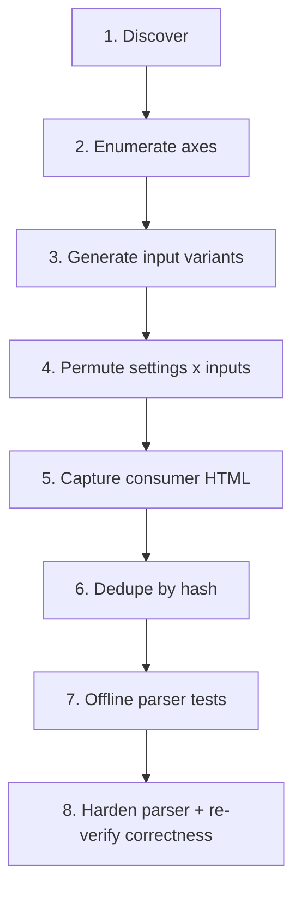

# Automated fixture generation for applet parsers

This document describes the reusable method used for the student timetable parser
and the intended layout for applying the same approach to other applets
(substitutions, conversations, calendar, …).

Goal: capture **real SPH HTML** under controlled settings, turn it into
**offline fixtures**, and prove the parser both **does not crash** and
**extracts the right data**.

Reference implementation: [`tool/timetable/`](timetable/).

---

## Layout (per applet)

Pack every applet’s tooling under `tool/<applet>/` so later applets mirror the
same shape:

```text
tool/<applet>/
  generate_inputs.dart      # discover school data + build uploadable variants
  scrape_settings.dart      # optional: dump admin/settings pages that affect HTML
  generate_permutations.dart
  dedupe_fixtures.dart
  <inputs>/                 # CSV / JSON / other payloads used as axes
  discovery/                # ephemeral HTML dumps (gitignored via tool/*/discovery/)
  run/                      # resume state (gitignored via tool/*/run/)

test/fixtures/<applet>/     # committed raw HTML + manifest.json
test/<applet>_parser_test.dart
```

Credentials stay in local dotenv files (never committed):

| File | Role |
|------|------|
| `.adminaccount.env` | Account that can change plans / settings (write where needed) |
| `.studentaccount.env` | Account that sees the student-facing HTML under test |

Each file provides `SCHOOLID`, `USERNAME`, `PASSWORD`. Tools load these files
themselves so the shell’s `USERNAME` cannot collide.

Use `EasyLanisClient.ephemeral(...)` from `package:liblanis/easy_client.dart`
for short-lived, authenticated sessions.

---

## Method overview



### 1. Discover what the school actually exposes

Before inventing fixtures, scrape the live admin / applet UI for:

- Entities the upload format needs (classes, courses, teachers, hours, …)
- Forms and query parameters that change rendered HTML
- Hidden settings that only appear on admin pages

Persist raw dumps under `tool/<applet>/discovery/` for local debugging; keep them
gitignored. A small `summary.json` of ids/labels is enough for generators.

**Timetable example:** Lerngruppen, Stundenraster, admin Anzeigeeinstellungen
(`VonBisAusblenden`, `KursnamenEinblenden`, `kursnamenvergleich`).

### 2. Enumerate axes that change parser-relevant HTML

Axes fall into two buckets:

1. **Content variants** — different payloads / plan shapes the applet can show
   (empty, sparse, dense, rowspan-heavy, collisions, edge formats, …).
2. **Display / filter settings** — admin or user toggles that change markup
   without changing the underlying data (hide times, rename labels, …).

Write the cartesian product down explicitly. Prefer settings discovered from
real forms over guessed ones. Axes that never change the consumer HTML will be
removed cheaply by dedupe later.

### 3. Generate uploadable input variants

Produce a directory of small, named inputs (CSV, JSON, …) plus an `index.json`:

```json
{
  "name": "02_single_monday_lesson",
  "description": "…",
  "rows": 1,
  "file": "tool/<applet>/<inputs>/02_single_monday_lesson.csv"
}
```

Practical tips:

- Embed a unique fingerprint per variant (e.g. room tag `RM02`) so polling can
  detect that the new content is live.
- Cover crash hypotheses from production (GlitchTip / Sentry), not only “happy
  path” data.
- Keep variants commit-able and regenerable from discovery.

### 4. Run resumable permutations

`generate_permutations.dart` should:

1. Build the full job list: `settings × inputs`.
2. Persist progress in `tool/<applet>/run/state.json` (atomic write via
   `state.json.tmp` → rename).
3. Support `--dry-run`, `--reset`, `--limit=N`, `--retry-failed`.
4. Group work so expensive uploads happen once per content variant, then vary
   cheap settings.
5. Restore original admin settings at the end when possible.

Each job writes one fixture named from its axes, e.g.:

```text
test/fixtures/<applet>/<input>__<axisA>-<v>__<axisB>-<v>.html
```

### 5. Capture consumer HTML reliably

Always fetch the **same view the parser uses** (student `stundenplan.php`, etc.).

SPH caches aggressively. Append a cache-buster on every relevant request:

```text
_cachebreaker=<unix_ms>
```

After applying a content/settings change, poll until readiness signals match the
job (fingerprint present/absent, expected counts, setting-specific markers). Do
not accept the first HTML if it can still be stale.

Constraints used for timetable (adapt per applet):

- Prefer authenticated HTTP via the client over brittle browser automation.
- Only **write** where required to set up the fixture; keep unrelated pages
  read-only.
- Save **raw** HTML (no anonymization that strips parser-critical structure).

### 6. Dedupe byte-identical fixtures

Many setting combinations produce identical HTML. After a full run:

```sh
dart run tool/<applet>/dedupe_fixtures.dart
```

- SHA-256 each `*.html`
- Keep the lexicographically first name per hash; delete the rest
- Rewrite `manifest.json` for kept files; write `dedupe_report.json`

This keeps the repo smaller while remaining reproducible.

### 7. Offline parser tests

Tests must not need network or credentials.

Minimum coverage:

1. **Every fixture parses without throwing**
2. **Parsed structure matches DOM ground truth** for that fixture
   (counts + stable fields such as names/rooms), not merely “returns something”
3. Targeted smoke cases for known production bugs (null tables, range errors, …)
4. When a setting hides metadata (e.g. times), assert lessons are **kept**, not
   silently dropped

Expose a static offline entry point on the parser, e.g.
`FooParser.parseDocumentHtml(Document)`, so tests need no session.

### 8. Reproduce → fix → verify correctness

Recommended order:

1. Run fixtures against the **unfixed** parser; record which crash classes appear.
2. Harden the parser against those classes.
3. Re-run: zero throws **and** DOM/content assertions still pass.
4. Watch for “fix by omission” — bounds checks that `continue` and drop real
   rows/cells. Prefer keep-with-fallback over skip when the DOM still has data.

---

## Standard CLI flow

```sh
# 1) Build input variants from live discovery
dart run tool/<applet>/generate_inputs.dart

# 2) Optional: map settings forms
dart run tool/<applet>/scrape_settings.dart

# 3) Capture all setting × input permutations (resumable)
dart run tool/<applet>/generate_permutations.dart
dart run tool/<applet>/generate_permutations.dart --limit=5   # smoke
dart run tool/<applet>/generate_permutations.dart --reset    # rebuild jobs

# 4) Drop identical HTML
dart run tool/<applet>/dedupe_fixtures.dart --dry-run
dart run tool/<applet>/dedupe_fixtures.dart

# 5) Verify parser
dart test test/<applet>_parser_test.dart
```

Timetable concrete commands:

```sh
dart run tool/timetable/generate_csvs.dart
dart run tool/timetable/generate_permutations.dart
dart run tool/timetable/dedupe_fixtures.dart
dart test test/timetable_parser_test.dart
```

---

## Checklist for a new applet

- [ ] `tool/<applet>/` directory with the layout above
- [ ] Local admin/student dotenv files (or a single account if roles allow)
- [ ] Discovery of entities + settings that affect consumer HTML
- [ ] Named input variants with fingerprints + `index.json`
- [ ] Resumable permutation runner with cache-busted fetches
- [ ] Raw HTML under `test/fixtures/<applet>/` + `manifest.json`
- [ ] Dedupe script
- [ ] Offline `parseDocumentHtml` (or equivalent)
- [ ] Tests: no-throw for all fixtures + DOM/content correctness
- [ ] GlitchTip/production issues listed as named regression cases

---

## What not to do

- Commit `.env` / account files.
- Rely on browser automation when authenticated HTTP already reaches the same
  endpoints.
- Commit huge identical HTML sets without hashing/dedupe.
- Treat “parses without throwing” as sufficient — always compare to DOM or other
  ground truth.
- “Fix” crashes by skipping cells that still exist in the HTML.
